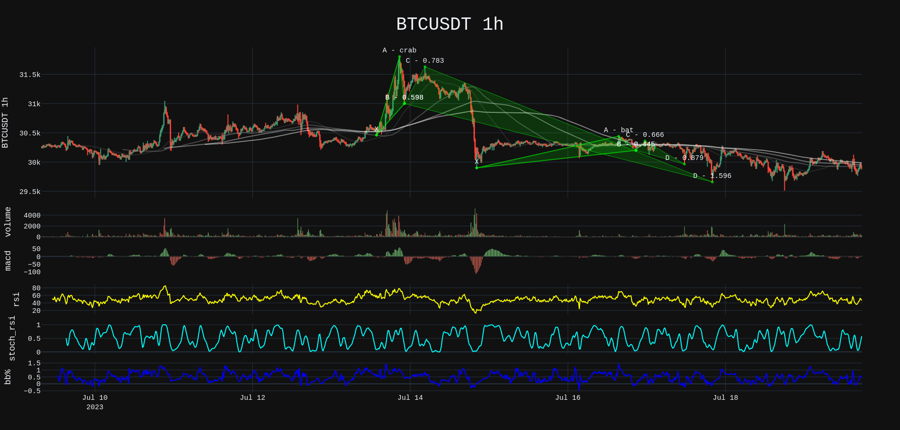
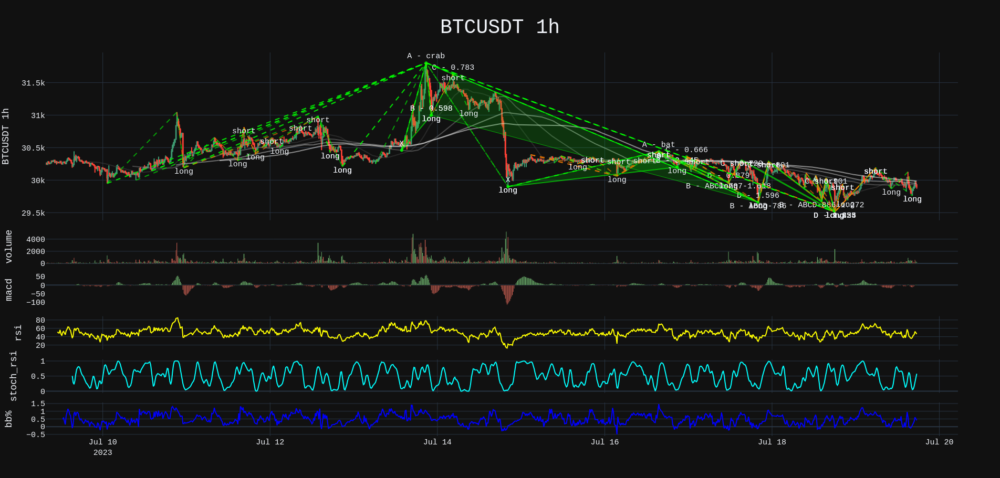
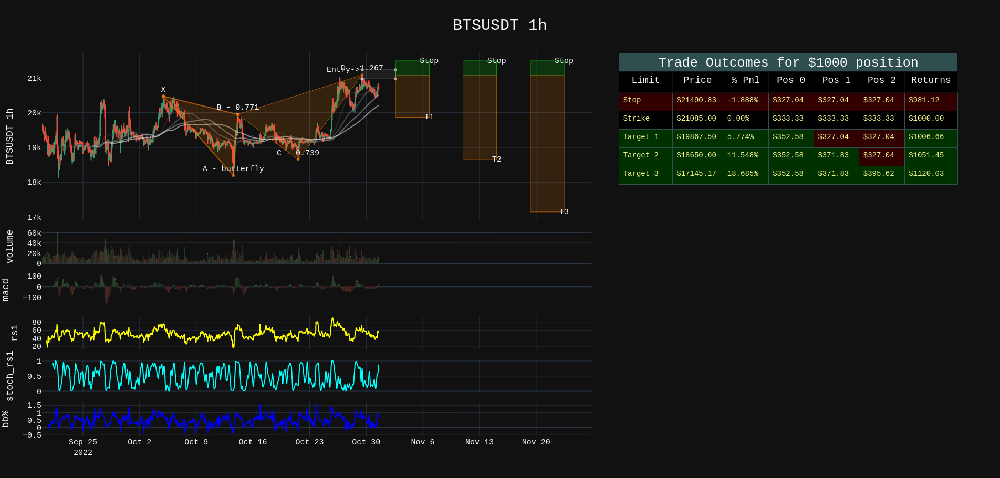
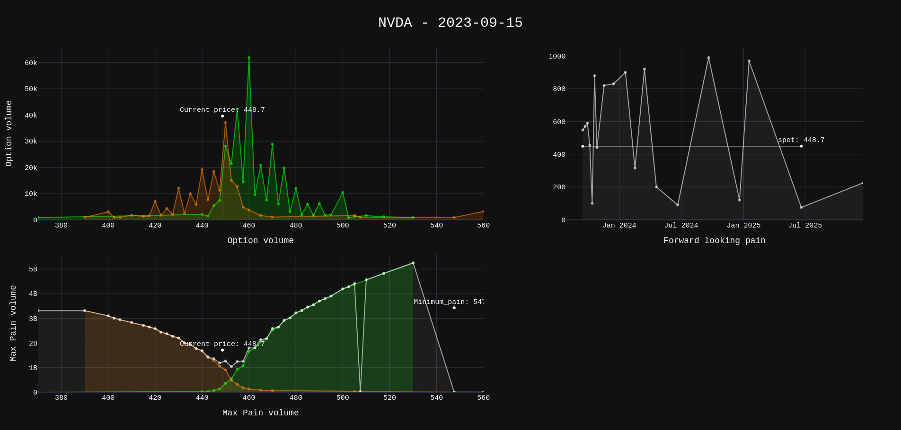

Plotting
--------

You can plot any technicals object ( OHLCTechnicals or Technicals) using a basic Plotter or position Plotter.

Plotting is not a function added to technicals because it should not be part of that object.  The plotters provided are basic but sufficent for testing and feedback.

Plot the findings.
~~~~~~~~~~~~~~~~~~
.. code-block:: python
       
  >>> from pyharmonics.plotter import Plotter
  >>> p = Plotter(t, 'BTCUSDT', b.HOUR_1)
  >>> p.add_harmonic_plots(m.get_patterns(family=m.XABCD))
  >>> p.show()

You will see something like this.

See all harmonic patterns.
~~~~~~~~~~~~~~~~~~~~~~~~~~
.. code-block:: python
       
  >>> p = Plotter(t, 'BTCUSDT', b.HOUR_1)
  >>> p.add_harmonic_plots(m.get_patterns())
  >>> p.show()

You will see something like this.

See all forming patterns.
~~~~~~~~~~~~~~~~~~~~~~~~~
.. code-block:: python
       
  >>> m = harmonicSearch(t)
  >>> m.forming()
  >>> p = Plotter(t, 'BTCUSDT', b.HOUR_1)
  >>> p.add_harmonic_plots(m.get_patterns(formed=False))
  >>> p.show()

Position Adding harmonic plots
------------------------------
.. code-block:: python

  >>> m = HarmonicSearch(t)
  >>> m.search()
  >>> patterns = m.get_patterns(family=m.XABCD)
  >>> pattern = patterns[m.XABCD][0]
  >>> # After extracting a pattern in isolation a position can be created.
  >>> # Position(pattern, symbol, interval, strike_price, dollar_amount)
  >>> position = Position(pattern, 'BTSUSDT', b.HOUR_1, pattern.y[-1], 1000)
  >>> p = PositionPlotter(t, position)
  >>> p.show()

The most useful plot feature is the position plot.

What is the position plot telling?
~~~~~~~~~~~~~~~~~~~~~~~~~~~~~~~~~~

There is a bearish pattern ( butterfly ).  The XAB leg of the price move was a .786 ( in tolerance ) move.  The ABC move was between .382 and .886.  The final XAD move was 1.27.  Sure enough at the price level there was a reaction and so the instruction is to set a price target at the confirmation price level.

The entry or strike price is $21085.  If a $1000 dollar amount is entered at this price level then the entire position is divided into 3 even parts.

* Target 1 is usually 50% of the CD leg move.
* The stop should be 1/3 of your target one move.
* Target 2 is the C point on the pattern.
* Target 3 is 1.618 times the cd leg.

The position is divided into 3 parts Pos1 Pos2 Pos3.

#. Pos1, Pos2, Pos3 will all close witha STOP if the price hits 21490 at a loss of -1.88%. This protects your account if the pattern does not play out.
#. Pos1, also close with a LIMIT at $19867 locking in a 21$ profit.  Pos2 and pos3 could still stop out but overall you are up $6.66
#. Pos2, can close if the price reaches $18650 BEFORE it hits the STOP price.  Pos3 could still stop out leaving you with $51.45 profit.
#. Finally if all 3 targets hit, you make $120 profit on the initial $1000 investment.  12% is not bad.

The %Move column in the plot beside the price column indicates the size of the move.  You don't get 18% profits with that move because you sold out along the way as a risk management strategy.

Call/Put Option Plots
---------------------

.. code-block:: python3

  >>> from pyharmonics.marketdata import YahooOptionData
  >>> from pyharmonics.plotter import OptionPlotter

  >>> yo = YahooOptionData('NVDA')
  >>> yo.analyse_options(trend='volume')
  >>> p = OptionPlotter(yo, yo.ticker.options[0])
  >>> p.show()

  >>> yo.analyse_options(trend='openInterest')
  >>> p = OptionPlotter(yo, yo.ticker.options[0])
  >>> p.show()

The trend or measure for your options activity can be ``volume`` or ``openInterest``.  The OptionPlotter takes a YahooOptionsData object and an expiry date for any plot.

Although the expiry dates are present in the YahooOptionsData object you must specifically select one to view.

.. note::

    ``volume`` or ``openInterest`` data resets daily. No activity for a trading can present false points of mimimum pain. Option plots are most complete by end of trading day (usually 16:30 EST)